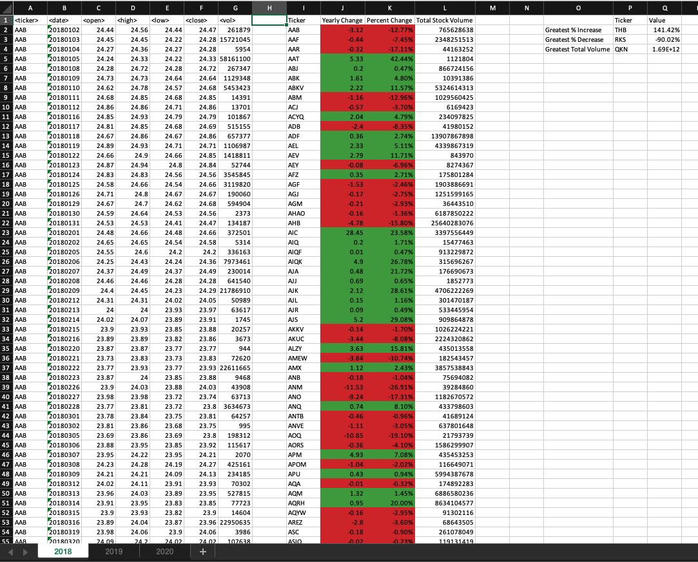
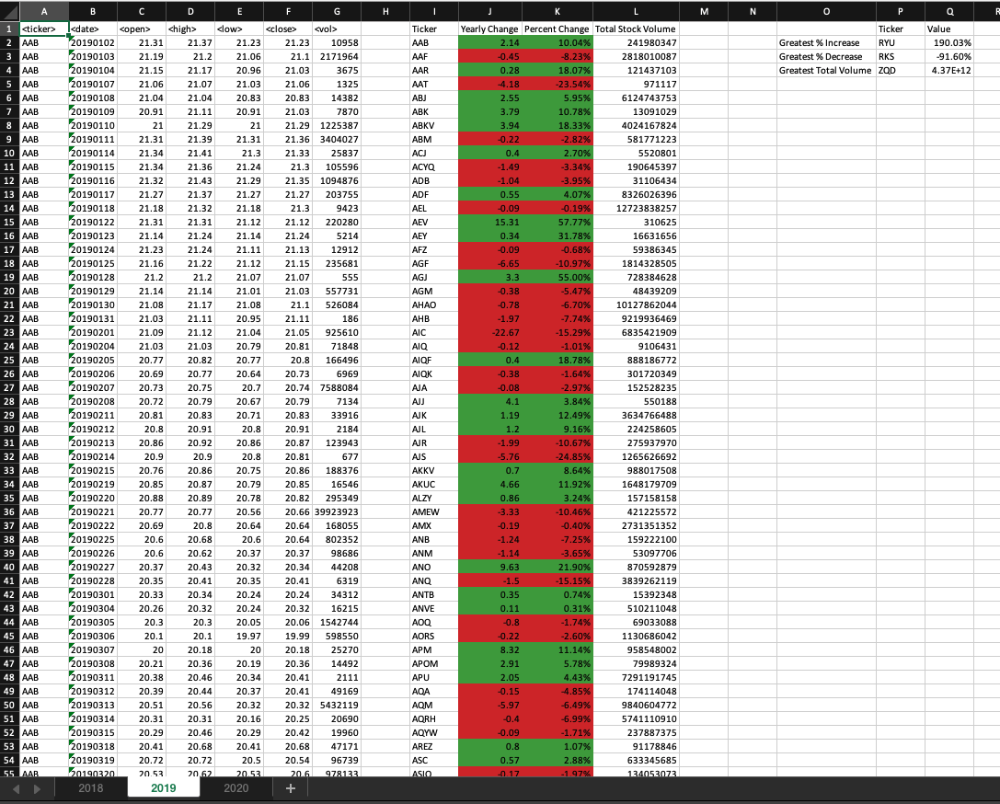
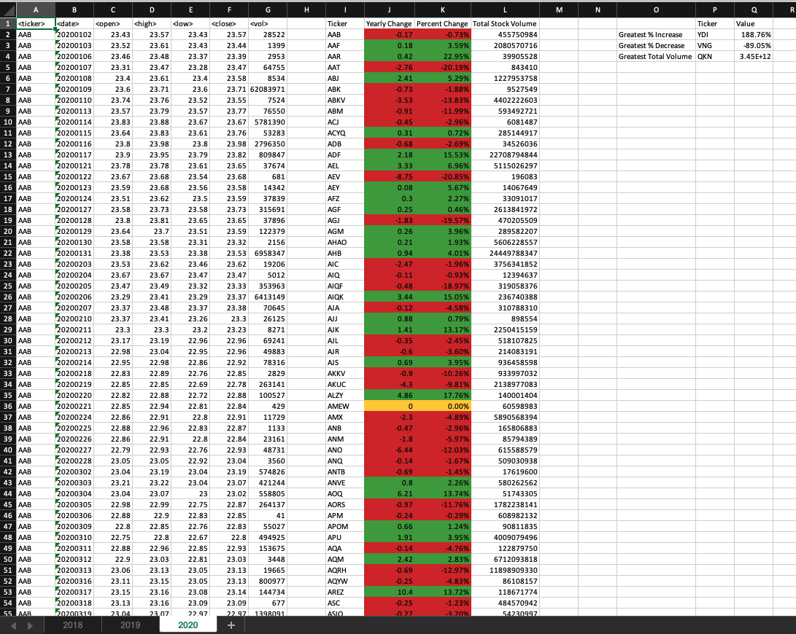

# VBA Challenge: Stock Analysis

**Student name:** Tania Barrera

---

This repo contains my work for the second weekly challenge of the UofT SCS edX Data Bootcamp.

**Goal:** Use VBA to perform an analysis on generated stock market data that runs recursively on all worksheets of an Excel workbook.

## Instructions

Create a script that loops through all the stocks for one year and outputs the following information:

- The ticker symbol

- Yearly change from the opening price at the beginning of a given year to the closing price at the end of that year.

- The percentage change from the opening price at the beginning of a given year to the closing price at the end of that year.

- The total stock volume of the stock.

- Add functionality to your script to return the stock with the "Greatest % increase", "Greatest % decrease", and "Greatest total volume".

- Make the appropriate adjustments to your VBA script to enable it to run on every worksheet (that is, every year) at once.

- Make sure to use conditional formatting that will highlight positive change in green and negative change in red.\*

## Results

The script contains 2 sub procedures: `Main()` and `CalculateYearData()`. To obtain the final solution, the sub procedure `Main()` loops through all the worksheets in the workbook and calls the sub procedure `CalculateYearData()` for each of them. 

The following screenshots show the final result after running the `Main()` sub procedure, with some column widths altered to improve readability of labels.

### 2018 worksheet

### 2019 worksheet

### 2020 worksheet

\* *Note:* Although the instructions do not indicate what to do for the conditional formatting if the change value is 0, I have made the background yellow for those cases, as seen in the 2020 worksheet screenshot. Another option would be for it to be red, because of inflation.

---

## References

#### Challenge instructions and starter Excel files, including generated data:  

© 2022 edX Boot Camps LLC. Confidential and Proprietary. All Rights Reserved.

#### Some code sections were adapted from these sources, specific explanations are found within the script comments:

| Purpose                            	| URL                                      	|
|------------------------------------	|------------------------------------------	|
| How to loop through all worksheets 	| https://excelchamps.com/vba/loop-sheets/ 	|
| How to turn off screen updating to improve performance	| https://learn.microsoft.com/en-us/office/vba/excel/concepts/cells-and-ranges/fill-a-value-down-into-blank-cells-in-a-column	|
| How to find last row that contains data	| https://www.excelcampus.com/vba/find-last-row-column-cell/	|
| Ways to improve performance, like decreasing how many times we are reading data from the worksheet and turning off screen updating	| https://www.soa.org/news-and-publications/newsletters/compact/2012/january/com-2012-iss42/excel-vba-speed-and-efficiency/	|
| How to use a collection to get unique values from an array	| https://stackoverflow.com/a/3017973	|
| Collections vs Arrays	| https://excelmacromastery.com/excel-vba-collections/	|
| How to declare dynamic arrays	| https://learn.microsoft.com/en-us/office/vba/language/concepts/getting-started/declaring-arrays	|
| How to search a value in an array	| https://www.excel-pratique.com/en/vba_tricks/search-in-array-function	|

